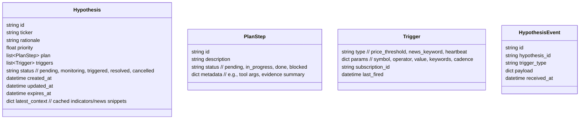

# Auto-Pilot Hypothesis Webhook Architecture

This document describes how to evolve TradingAgents from "fire-and-forget" auto-trade runs into a persistent, event-driven autopilot that keeps hypotheses alive, listens for webhooks (price/news/deadline), and reruns the decision pipeline whenever fresh context arrives.

## Goals

1. **Hypothesis lifecycle awareness** – record every hypothesis (ticker, rationale, triggers, expiry) so we can resume work without re-running the full CLI loop.
2. **Event subscriptions** – for each hypothesis, subscribe to market data and news webhooks (or schedule polling fallbacks) so updates push into the system.
3. **Autonomous reevaluation** – when an event or deadline fires, spin a focused Responses run for that ticker using the stored plan + new evidence, optionally executing trades.
4. **Operator visibility** – expose hypothesis status, last event, and upcoming triggers both in the CLI and via logs/metrics.

## High-Level Components

| Component | Responsibility |
| --- | --- |
| **Auto-Trade Runner (existing)** | Seeds new hypotheses via CLI run; persists plan/memory snapshots. |
| **Hypothesis Registry (new service / module)** | Stores hypotheses, plan tracker, triggers, active status, timestamps. Provides CRUD + query APIs. |
| **Subscription Broker** | Translates hypothesis triggers into concrete subscriptions: price alerts, scheduled polls, news feeds. Emits events back into the registry. |
| **Event Queue / Webhook Ingress** | Receives vendor callbacks (HTTP POST), normalizes payloads, and enqueues `HypothesisEvent` messages. |
| **Hypothesis Worker** | Consumes events, fetches the hypothesis state, runs a scoped Responses plan (or graph propagator), updates decisions/trades, and writes a new memory entry. |
| **Scheduler / Heartbeats** | Ensures every hypothesis is re-evaluated at deadlines even without external events. |
| **Notifications** | Optional module to push summaries to Slack/email once a hypothesis changes state or executes trades. |

## Data Model



## Event Flow

1. **Registration**
   - After the CLI auto-trade run emits decisions, call `POST /hypotheses` with ticker, plan, triggers, and expiry. The registry responds with `hypothesis_id`.
   - For each trigger, call the Subscription Broker (`POST /subscriptions`) which either:
     - Registers a vendor webhook (e.g., Polygon alert), storing the callback target (`/events/vendor`), or
     - Schedules a polling job / cron for news feeds.

2. **Event Ingress**
   - Vendor posts to `/events/vendor` with its raw payload.
   - Broker normalizes to `HypothesisEvent` and enqueues it (e.g., Redis stream / SQS / PostgreSQL table).

3. **Hypothesis Worker**
   - Worker dequeues the event, loads the hypothesis + plan, and constructs a mini conversation for Responses:
     ```json
     {
       "hypothesis": {...},
       "last_plan": [...],
       "event": {"type": "price_threshold", "payload": {...}}
     }
     ```
   - Responses returns updated plan_status, decisions, and optional trades.
   - Worker executes trades via existing `submit_trade_order` tooling (respecting dry-run), updates plan statuses, and emits notifications.

4. **Heartbeats / Deadlines**
   - Scheduler queues `HypothesisEvent(type=heartbeat)` at `expires_at` or `next_check_at` to force reevaluation if no external trigger fires.

5. **Resolution**
   - When a hypothesis executes its plan (trade complete, catalyst resolved, or manually cancelled), mark status `resolved` and cancel all subscriptions.

## API Sketch

### Hypothesis Registry
```
POST /hypotheses
{
  "ticker": "TSLA",
  "rationale": "Watch for breakout > 435",
  "priority": 0.7,
  "plan": [
    {"id": "step_tsla_market_7d", "description": "Fetch 7-day market data", "status": "pending"},
    {"id": "step_tsla_news", "description": "Fetch news (5d)", "status": "pending"}
  ],
  "triggers": [
    {"type": "price_threshold", "params": {"symbol": "TSLA", "operator": ">=", "value": 435}},
    {"type": "heartbeat", "params": {"interval_minutes": 120}}
  ],
  "expires_at": "2025-11-14T21:00:00Z"
}
```

### Subscription Broker
```
POST /subscriptions
{
  "hypothesis_id": "hypo_tsla_001",
  "trigger_id": "trig_price_1",
  "type": "price_threshold",
  "params": {"symbol": "TSLA", "operator": ">=", "value": 435}
}
```
_Response_: `{ "subscription_id": "sub_polygon_abc" }`

### Event Ingress
```
POST /events/vendor
{
  "subscription_id": "sub_polygon_abc",
  "vendor": "polygon",
  "payload": {"symbol": "TSLA", "price": 435.2, "timestamp": "..."}
}
```

### Hypothesis Worker Output
```
PATCH /hypotheses/hypo_tsla_001
{
  "status": "monitoring",
  "plan": [
    {"id": "step_tsla_market_7d", "status": "done", "evidence": "Price dropped to 397"},
    ...
  ],
  "latest_context": {"price": 435.2, "news_sentiment": 0.18},
  "next_check_at": "2025-11-14T18:00:00Z"
}
```

## Implementation Plan

1. **Data layer**
   - Create `Hypothesis` + `PlanStep` models (SQLAlchemy/Prisma/SQLite) under `tradingagents/services/hypotheses/`.
   - Provide `HypothesisStore` with CRUD and serialization to feed Responses runs.

2. **CLI → Registry hook**
   - After `AutoTradeResult` is produced, translate each decision into a hypothesis payload and POST to the registry (or call local store API). Include plan_steps derived from `decision.sequential_plan.actions` and triggers derived from `action_queue` or heuristics.

3. **Subscription Broker**
   - MVP: cron-based pollers (every N minutes) for price + news; advanced: integrate Polygon/IEX price alerts and Benzinga/Finhub news webhooks.
   - Maintain mapping `subscription_id → hypothesis_id, trigger_id`.

4. **Event Queue**
   - Simple approach: Postgres table `hypothesis_events` + worker loop.
   - Scalable option: Redis stream / AWS SQS.

5. **Hypothesis Worker**
   - Reuse `ResponsesAutoTradeService` but scope conversation to the single ticker + event.
   - Provide `HypothesisContextBuilder` to gather memory, last plan, and event payload.
   - Record new plan statuses + trade actions; append to memory store.

6. **Scheduler**
   - Use APScheduler/Celery beat to enqueue `heartbeat` events per hypothesis (e.g., every 2h and at market close).

7. **Notifications / CLI integration**
   - CLI command `tradingagents cli hypotheses list` to show status, last event, next trigger.
   - Optional: Slack webhook when hypothesis transitions to `triggered` or executes a trade.

### MVP status

- ✅ Hypothesis store + CLI viewer
- ✅ Event queue + manual simulation
- ✅ Price-threshold broker (polling) that enqueues events
- ✅ Realtime brokers: stock trades via `StockDataStream` and Alpaca news (`wss://stream.data.alpaca.markets/v1beta1/news`) that forward triggers to the autopilot worker.
- ✅ Worker that marks plan steps done *and* re-runs the auto-trade pipeline (Responses/graph) for the affected ticker using `focus_override` to keep the reevaluation scoped.
- ⏳ Next: plug real webhook providers and extend the worker to place trades automatically once decisions flip to BUY/SELL.

## Notes on Webhooks vs Polling

- **Price Alerts** – Polygon.io, Alpaca, and Tiingo all support webhook alerts. We can fall back to `subscribe_price(symbol, operator, value)` that polls every minute if no webhook support.
- **News** – Few providers push webhooks. Run a background RSS/REST poller that hits Benzinga/Alpha Vantage news endpoints and emits synthetic webhook events.
- **Deadlines** – Heartbeats require no vendor support: schedule `HypothesisEvent(type="deadline")` using APScheduler or a managed cron (Temporal, Airflow).

## Next Steps

1. Implement the `HypothesisStore` and registry API (FastAPI blueprint or Flask blueprint under `tradingagents/services`).
2. Extend `AutoTradeResult` handling to register hypotheses + plan steps.
3. Build the subscription broker (start with polling, abstract interface for real vendor webhooks later).
4. Create the worker that consumes events and reuses the Responses orchestrator with focused prompts.
5. Update CLI to display hypothesis queue and allow manual cancellation.
6. Add config knobs for enabling autopilot mode, vendor credentials, heartbeat interval, and maximum concurrent hypotheses.

With these pieces in place, hypothesized trades can stay "alive" outside the CLI session, react instantly to price/news events, and keep the plan tracker up to date via webhook-driven reevaluations.
